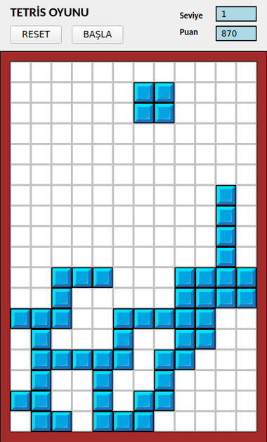

# 🧱 Tetris (Python + PyQt5)

A desktop Tetris game written in Python with PyQt5. Built during my software internship at the General Directorate of Highways (2024) to practise algorithm design and object-oriented programming.



## ✨ Features

- All 7 classic tetrominoes (I, O, T, S, Z, L, J) with clockwise rotation
- Collision detection against walls and placed blocks
- Full-line detection and clearing, with the rows above shifting down
- Score and level system: the game speeds up as your score grows
- Sound effects for placing a piece, clearing a line and game over
- Pause, reset and "play again?" dialog

## 🎮 Controls

| Key | Action |
|---|---|
| `←` `→` | Move left / right |
| `↑` | Rotate |
| `↓` | Drop the piece |
| `Space` | Pause |

Click **BAŞLA** to start and **RESET** to start over.

## 📊 Scoring

- You start with **1000** points; each new piece costs **10** points
- Each cleared line gives **+250** points
- Every **2000** points you reach the next level, and pieces fall faster (fall interval = 1000 ms ÷ level)

## 🧠 How it works

The code is organised around a few classes:

- **`Blok`** – a single cell on the board and whether it is filled
- **`Tahta`** (board) – the 12 × 18 grid: collision checks, placing pieces, detecting and clearing full lines
- **`Tas`** (piece) – a tetromino made of 4 blocks, with movement and per-shape rotation logic
- **`MainWindow`** – the PyQt5 window: draws the board with `QPainter`, runs the game loop with `QTimer`, handles keyboard input and plays sounds with `QMediaPlayer`

## 🚀 Run it

```bash
git clone https://github.com/senakck/Tetris-Python.git
cd Tetris-Python
pip install -r requirements.txt
python main.py
```

Requires Python 3.8+.
